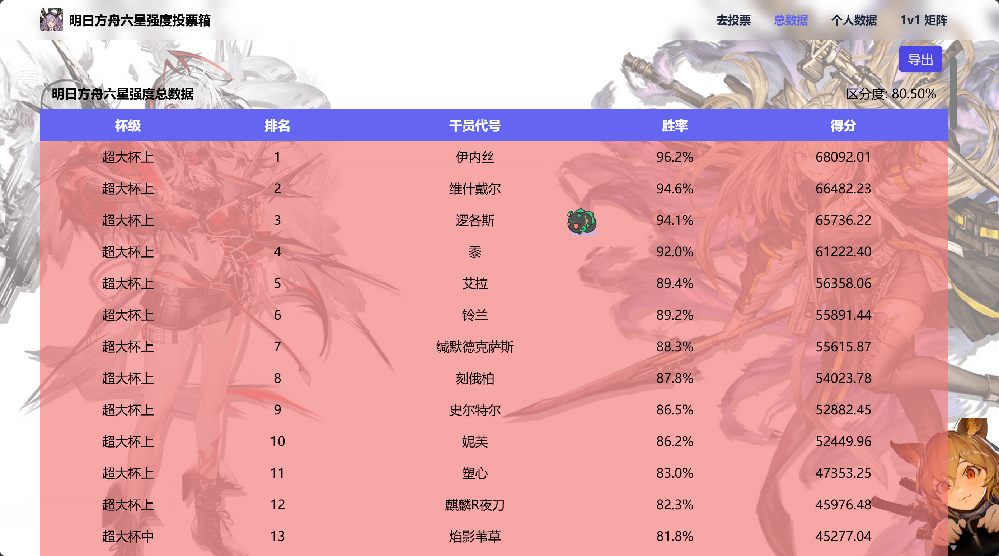
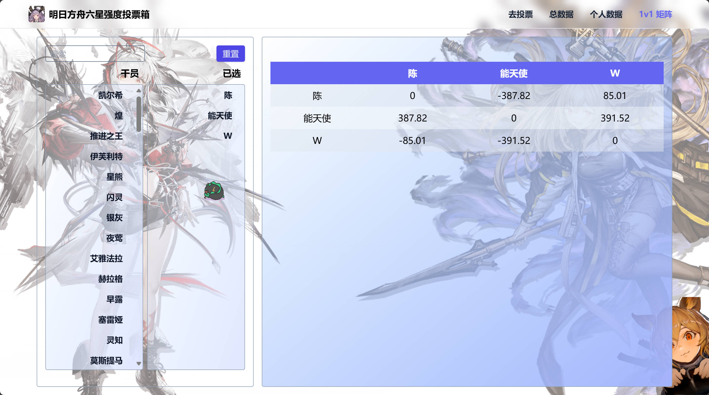
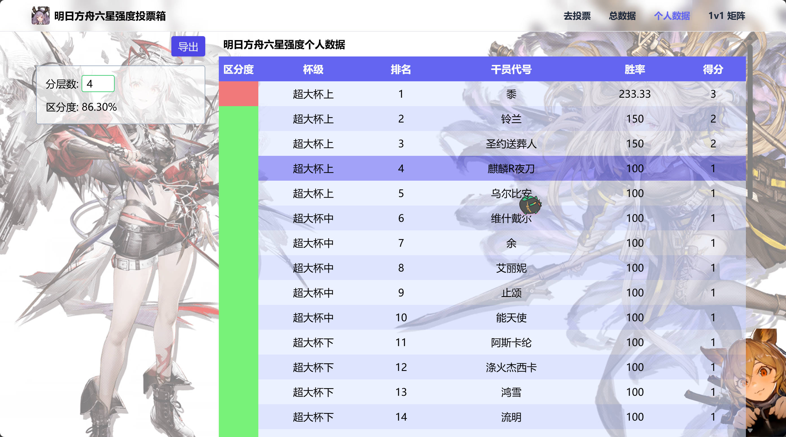

# 明日方舟六星 强度投票箱前端

## 待完成

- 数据页
  - 分层控制
  - 背景色是否就是目前的整块
- 请求是否正确
  - 若不正确，调整 `src/api` 下的返回值

## 展示

<p align="center">
  
  
  
  

  
  
</p>

## 使用

安装依赖:

```bash
# pnpm
pnpm install

# npm
npm install
```

运行:

```bash
# pnpm
pnpm dev

# npm
npm run dev
```

## mocks

可以在 `vite.config.ts` 选择是否开启，更改 `enable` 的值

```ts
{
  plugins: [
    // ....

    viteMockServe({
      mockPath: './mock',
      // enable: idDev,
      enable: false,
    }),
  ]
}
```
